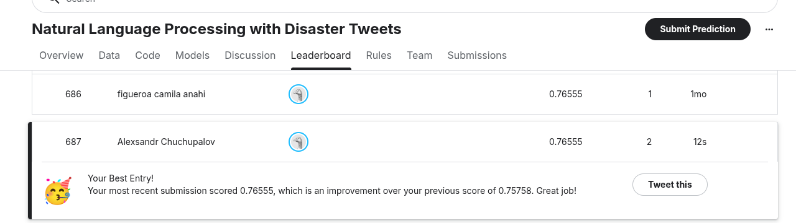

# NLP-DisasterTweets

This repository contains my solution for the Kaggle competition "Natural Language Processing with Disaster Tweets". The goal is to build a machine learning model that can guess if a tweet is about a real disaster or not.

## Project Overview

Twitter is often used to report emergencies in real-time. Organizations want to monitor these tweets to respond quickly. However, it can be hard to tell if a tweet like "The sky is on fire" is about a literal fire or just a sunset. My goal was to use Deep Learning to distinguish between the two.

## How I Did It

### 1. Cleaning the Data
I started by cleaning up the tweets. I removed things like website links (URLs) and punctuation marks, and I converted everything to lowercase letters so the model wouldn't get confused.

### 2. Preparing the Text
Computers don't understand words, so I converted the text into numbers using "Embeddings". This helps the model understand the meaning of words based on context.

### 3. Building the Model
I experimented with two types of Recurrent Neural Networks (RNNs) using PyTorch:
*   **Bidirectional LSTM**: This model looks at the sentence forwards and backwards to understand the full context.
*   **Bidirectional GRU**: A slightly simpler and faster version of the LSTM.

I trained both models and compared them to see which one performed better.

## Results

I used the **F1 Score** to measure success because it gives a better idea of performance than just simple accuracy for this kind of problem. The notebook automatically picks the best model (the one with the highest F1 score) to create the final predictions.

## How to Run

1.  **Get the code**:
    Clone this repository to your computer and downlaod the kaggle dataset to the data folder. 

2.  **Install libraries**:
    Make sure you have Python installed, along with libraries like `pandas`, `numpy`, `torch`, `matplotlib`, and `seaborn`.

3.  **Run the Notebook**:
    Open the `Disaster_Tweets_Project.ipynb` file in Jupyter Notebook and run all the cells.
